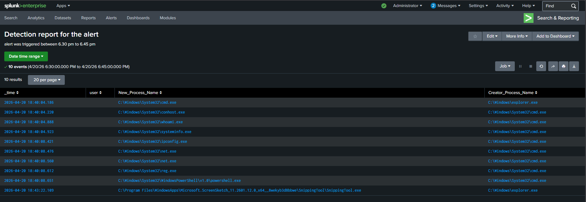
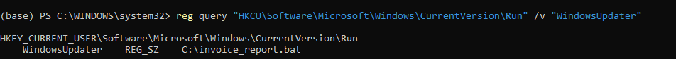
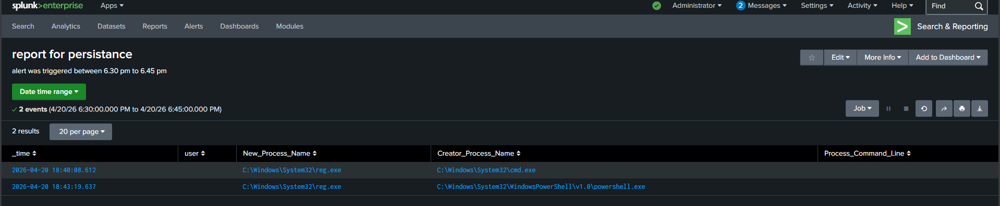
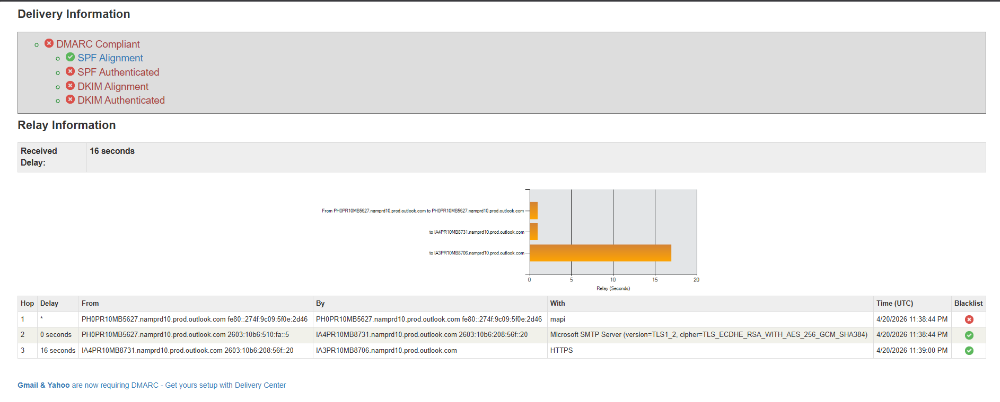
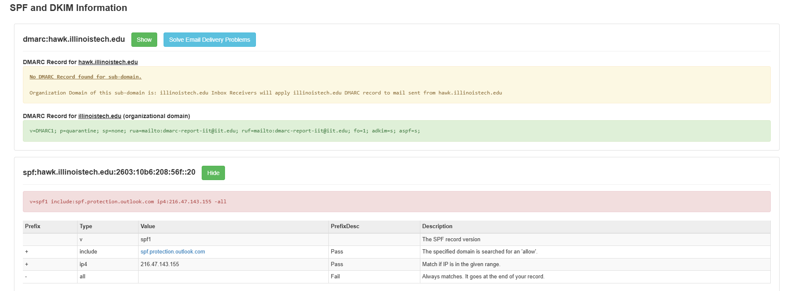
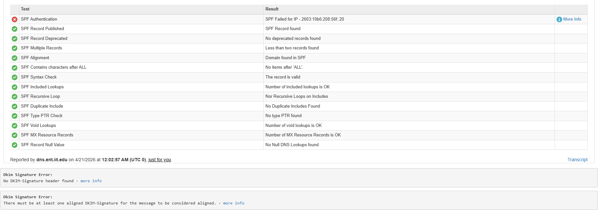
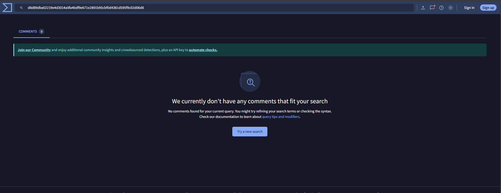

# Phase 2 - Detection

## Overview

This phase documents how the attack was detected and investigated using Windows Event Logs and Splunk SIEM. No prior knowledge of the attack was assumed during the investigation - the goal was to hunt for suspicious activity purely through log analysis, the same way a real SOC analyst would.

---

## Detection Approach

In a real SOC environment, analysts do not know what to look for upfront. Logs are noisy - hundreds of processes run every minute across a typical Windows machine. The approach used here was **behavioral hunting** - instead of searching for a specific file or process name, we searched for suspicious relationships between processes.

**Core principle:**
> If a process spawns `cmd.exe` or `powershell.exe` unexpectedly - that is a red flag worth investigating.

---

## Step 1 - Confirming Audit Policy

Before reviewing logs, process creation logging was verified to be active on the victim machine.

```powershell
auditpol /get /subcategory:"Process Creation"
```

Expected output:
Process Creation    Success and Failure

Without this setting enabled, Event ID 4688 logs would not exist and the entire attack chain would be invisible.

---

## Step 2 - Identifying the Right Event ID

Windows logs many types of events. The key event for tracking process activity is:

| Event ID | Description |
|---|---|
| 4688 | A new process has been created |
| 4624 | A user logged on |
| 4657 | A registry value was modified |
| 4104 | PowerShell script block executed |

**Event ID 4688** was the primary focus - it records every new process that starts, including who started it and what process created it. This parent-child relationship is the foundation of the entire investigation.

---

## Step 3 - Initial Broad Hunt in Splunk

The investigation started with a broad search - all Event ID 4688 events across all indexes, excluding known Splunk noise.

```spl
index=* EventCode=4688
| where Creator_Process_Name!="E:\\splunk forwarder\\bin\\splunkd.exe"
AND Creator_Process_Name!="C:\\Program Files\\Splunk\\bin\\splunkd.exe"
| table _time, user, New_Process_Name, Creator_Process_Name
| sort _time
```

This returned over 1,500 events - too many to review manually. The next step was to narrow down using suspicious parent process patterns.

---

## Step 4 - Hunting for Suspicious Parent Processes

The search was narrowed to focus on three parent processes that should rarely spawn child processes in normal user activity:

```spl
index=* EventCode=4688
| where Creator_Process_Name="C:\\Windows\\System32\\cmd.exe"
OR Creator_Process_Name="C:\\Windows\\System32\\WindowsPowerShell\\v1.0\\powershell.exe"
OR Creator_Process_Name="C:\\Windows\\explorer.exe"
| where NOT New_Process_Name LIKE "%splunk%"
AND NOT New_Process_Name LIKE "%btool%"
AND NOT New_Process_Name LIKE "%conda%"
| table _time, user, New_Process_Name, Creator_Process_Name
| sort _time
```

**Why these three parents?**

| Parent Process | Why Suspicious |
|---|---|
| `cmd.exe` spawning anything | Scripts executing commands or payloads |
| `powershell.exe` spawning anything | Scripts dropping or executing binaries |
| `explorer.exe` spawning cmd or scripts | User directly opened and ran a malicious file |

This query was saved as a reusable Splunk report named **"Suspicious Process Chain - Event 4688"** for future threat hunting.

---

## Step 5 - Identifying the Attack Chain

Reviewing the results within the timeframe of the alert, the following sequence was identified:

| Time | New Process | Parent Process | Assessment |
|---|---|---|---|
| 18:40:04.186 | cmd.exe | explorer.exe | User ran a script directly |
| 18:40:04.220 | conhost.exe | cmd.exe | Normal child of cmd |
| 18:40:04.888 | whoami.exe | cmd.exe | Recon - identifying user context |
| 18:40:04.923 | systeminfo.exe | cmd.exe | Recon - profiling OS |
| 18:40:08.421 | ipconfig.exe | cmd.exe |  Recon - mapping network |
| 18:40:08.476 | net.exe | cmd.exe |  Recon - enumerating users |
| 18:40:08.560 | net.exe | cmd.exe |  Recon - enumerating admins |
| 18:40:08.612 | reg.exe | cmd.exe |  Persistence - registry modification |
| 18:40:08.651 | powershell.exe | cmd.exe |  C2 - outbound connection |

**The key red flag:** `explorer.exe` spawning `cmd.exe`. Under normal circumstances, a user opening a document or file does not result in a command prompt being launched. This single relationship was the entry point of the entire investigation.



---

## Step 6 - Confirming Persistence

The presence of `reg.exe` in the process chain indicated a registry modification. The following query was run to isolate this event:

```spl
index=* EventCode=4688
| where New_Process_Name="C:\\Windows\\System32\\reg.exe"
| table _time, user, New_Process_Name, Creator_Process_Name
| sort _time
```

This confirmed `reg.exe` was spawned by `cmd.exe` at 18:40:08 - consistent with the attack chain timeline.

The victim machine's registry was then inspected directly:

```powershell
reg query "HKCU\Software\Microsoft\Windows\CurrentVersion\Run"
```

A malicious entry was found:
WindowsUpdater    REG_SZ    C:\Users\theep\invoice_report.bat

The entry name `WindowsUpdater` was deliberately chosen to blend in with legitimate startup entries such as OneDrive, Spotify, and Discord - a masquerading technique. The malicious entry was only identified by cross-referencing each startup value against known legitimate software.

  




---

## Step 7 - Confirming C2 Activity

The final process in the chain - `powershell.exe` spawned by `cmd.exe` - was assessed as a C2 beacon based on:

- PowerShell has no legitimate reason to be launched by a batch script in this context
- It was the last process in an automated recon and persistence sequence
- The destination `192.168.0.24` on port `4444` is not associated with any approved business application
- Port `4444` is commonly associated with reverse shell frameworks such as Metasploit and netcat

---

## Step 8 - Email Header Analysis

The phishing email that triggered the attack was retrieved from the victim mailbox and raw headers were extracted. Headers were analyzed using MXToolbox to assess email authentication and delivery path.

**Key findings:**

| Check | Result | Significance |
|---|---|---|
| DKIM |  Failed | Email was not digitally signed |
| DMARC | Failed | No domain protection policy enforced |
| SPF |  Failed | Sender not authorized by domain |
| SCL Score | 1 | Email bypassed spam filters despite failures |
| Originating Server | Blacklisted | Server has known bad reputation |





Despite failing all three authentication checks, the email was delivered successfully because both sender and recipient were on the same Outlook tenant - treated as internal mail. The subdomain `hawk.illinoistech.edu` had no DMARC record configured, leaving it without spoofing protection.

---

## Step 9 - Payload Hash Analysis

The malicious file `invoice_report.bat` was identified on the victim machine and its SHA256 hash was submitted to VirusTotal.
d8d89dba02219e4d3014a0fa4bdf9e671e2891b95cbf0d4381d595f9c02d06d8

VirusTotal returned zero detections across all antivirus engines - confirming the payload was custom-built and had no prior signatures. This means traditional antivirus provided no protection in this scenario. Behavioral detection through Splunk was the only effective control.



---

## Detection Summary

| Phase | Detected Via | Evidence |
|---|---|---|
| Execution | Event ID 4688 - explorer.exe → cmd.exe | Splunk process chain |
| Recon | Event ID 4688 - cmd.exe → whoami, systeminfo, ipconfig, net | Splunk process chain |
| Persistence | Event ID 4688 - cmd.exe → reg.exe + registry query | Splunk + PowerShell |
| C2 | Event ID 4688 - cmd.exe → powershell.exe | Splunk process chain |
| Email | MXToolbox header analysis | DKIM, DMARC, SPF failures |
| Payload | SHA256 hash - VirusTotal | Zero detections |

**Key takeaway:** The entire attack chain was detected using a single Splunk query hunting for suspicious parent-child process relationships. No knowledge of the specific payload, filename, or attacker IP was required to find it.
